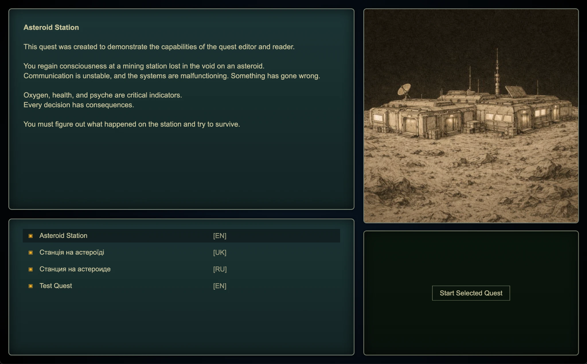

[English](README.md) | [Українська](README.ua.md)

# Quest Reader Electron


Десктопний застосунок на Electron для запуску текстових квестів з розгалуженим сюжетом, параметрами, виборами, зображеннями, музикою та звуковими ефектами.

Натхненний механіками класичної гри **Space Rangers**.

Разом із [Text Quest Editor](https://github.com/albruevich/Text-Quest-Editor) утворює повний набір інструментів для створення та проходження власних текстових квестів.

---

## Demo



---

## Про проєкт

Проєкт написаний на **TypeScript** та побудований на **Electron**.

Це самостійний десктопний застосунок для інтерактивних текстових квестів із гнучкою JSON-архітектурою.

Варіанти використання:

- проходження вбудованих квестів, таких як **Asteroid Station**
- тестування квестів, створених у Text Quest Editor
- використання як основи для власного рідера

---

## Можливості

- Розгалужена структура квестів з кількома фіналами
- Параметри, що впливають на проходження та вибір
- Умовні переходи на основі логіки квесту
- Зображення, звукові ефекти та фонова музика
- Керування клавіатурою та мишею
- JSON-система зберігання контенту

---

## Структура квестів

Кожен квест зберігається окремою папкою в:

```text
_Quests/
```

Приклад:

```text
_Quests/
  AsteroidStation/
    quest.json
    Images/
    Sounds/
    Musics/
```

### Вміст

- `quest.json` — головний файл квесту
- `Images/` — необов’язкові зображення
- `Sounds/` — необов’язкові звуки
- `Musics/` — необов’язкова музика

Рідер автоматично знаходить усі коректні папки квестів.

---

## Як запустити

### 1. Встановіть Node.js

Завантажте та встановіть **LTS** версію:

https://nodejs.org/

### 2. Відкрийте папку проєкту

Відкрийте папку у:

- Terminal (macOS / Linux)
- Command Prompt або PowerShell (Windows)

(За бажанням можна використовувати Visual Studio Code)

### 3. Встановіть залежності

```bash
npm install
```

### 4. Запустіть застосунок

```bash
npm start
```

Ця команда скомпілює TypeScript-код і запустить Electron застосунок.

---

## Керування

- `↑ / ↓` — вибір варіантів
- `Enter` — підтвердити
- `Esc` — вийти з поточного квесту

---

## Технічні особливості

- Десктопний застосунок на Electron
- Структура проєкту на TypeScript
- JSON-архітектура контенту
- Завантаження ресурсів із локальної файлової системи
- Інтеграція мультимедіа
- Модульна логіка квестів

---

## Пов’язані проєкти

[Text Quest Reader (Unity)](https://github.com/albruevich/Text-Quest-Reader)

[Text Quest Editor](https://github.com/albruevich/Text-Quest-Editor)

---

## Вимоги

- Node.js
- npm

---

## Ресурси

Деякі зображення у цьому проєкті були створені за допомогою AI-інструментів.

Звукові ефекти та музика можуть містити royalty-free ресурси, зокрема Pixabay.

---

## Ліцензія

MIT License

---

## Автор

Alexander Bruiaka

GitHub: https://github.com/albruevich
